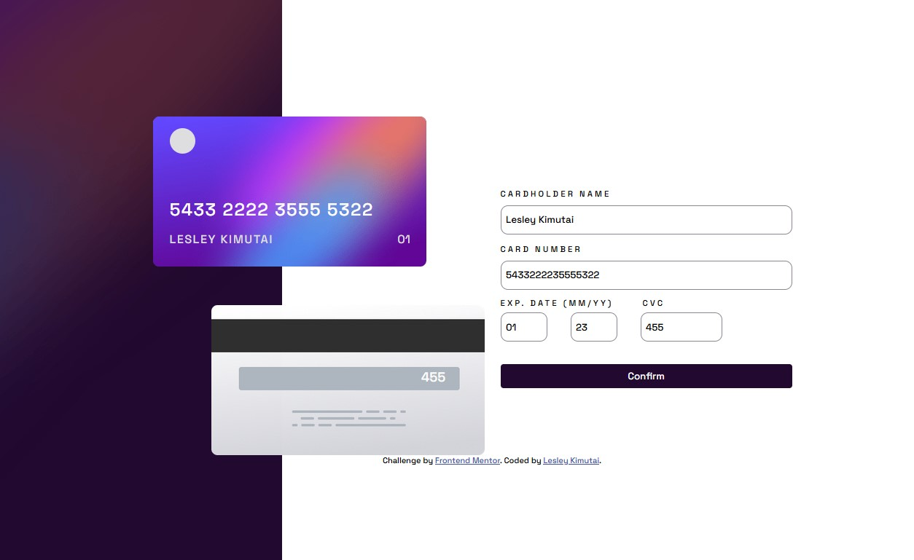

# Frontend Mentor - Interactive card details form solution

This is a solution to the [Interactive card details form challenge on Frontend Mentor](https://www.frontendmentor.io/challenges/interactive-card-details-form-XpS8cKZDWw). Frontend Mentor challenges help you improve your coding skills by building realistic projects.

## Table of contents

- [Frontend Mentor - Interactive card details form solution](#frontend-mentor---interactive-card-details-form-solution)
  - [Table of contents](#table-of-contents)
  - [Overview](#overview)
    - [The challenge](#the-challenge)
    - [Screenshot](#screenshot)
    - [Links](#links)
  - [My process](#my-process)
    - [Built with](#built-with)
    - [What I learned](#what-i-learned)
    - [Continued development](#continued-development)
    - [Useful resources](#useful-resources)
  - [Author](#author)
  - [Acknowledgments](#acknowledgments)


## Overview

### The challenge

Users should be able to:

- Fill in the form and see the card details update in real-time
- Receive error messages when the form is submitted if:
  - Any input field is empty
  - The card number, expiry date, or CVC fields are in the wrong format
- View the optimal layout depending on their device's screen size
- See hover, active, and focus states for interactive elements on the page

### Screenshot

Laptop Size View of the Card Mockup: -



Mobile Size view of the mockup: -


### Links

- Solution URL: [GH Link](https://github.com/issagoodlifeInc/interactive-card.git)
- Live Site URL: [Live Netlify Deploy](https://interactivecardlk.netlify.app/)

## My process

### Built with

- Semantic HTML5 markup
- CSS custom properties
- Flexbox
- Mobile-first workflow

### What I learned

- Rebuilt the form markup with associated labels, accessible error-message regions, suitable autocomplete/input modes, and a dedicated success state.
- Connected all five inputs to the card preview so the name, grouped card number, expiry, and CVC update while typing. Empty fields show the design's default card details.
- Added submit-time validation for required values, a 16-digit card number, a month from 01 to 12 and two-digit year, and a three-digit CVC. Errors are announced through each field's accessible description and clear as corrected values are entered.
- Added a completion screen after valid submission. **Continue** resets the form, errors, and preview so another card can be entered.
- Reworked the layout for desktop and mobile, with overlapping cards on small screens, plus hover, active, keyboard-focus, and reduced-motion styles.

## How it works

`index.html` contains the card preview, form, and completion view. `assets/main.js` listens for input events to sanitize numeric fields and update the preview; on submission it validates the values and switches to the completion view only when all fields pass. The Continue button resets the form and restores the default preview. `assets/styles.css` provides the desktop/mobile layouts, visual states, and error styling.

This is a front-end challenge demo only. It does not send, store, or process payment information.


### Continued development

My understanding on how to handle interactive elements.

```js
function updateCard() {
  const digits = fields.number.value.replace(/\D/g, "").slice(0, 16);
  fields.number.value = digits.replace(/(\d{4})(?=\d)/g, "$1 ");
  card.number.textContent = digits
    ? digits.replace(/(\d{4})(?=\d)/g, "$1 ")
    : "0000 0000 0000 0000";

  const name = fields.name.value.trim();
  card.name.textContent = name || "Jane Appleseed";
  card.month.textContent = fields.month.value || "00";
  card.year.textContent = fields.year.value || "00";
  card.cvc.textContent = fields.cvc.value || "000";
}

```

<!-- Dynamic event listener -->
```js

  Object.values(fields).forEach((input) => {
  input.addEventListener("input", () => {
    if (input === fields.month || input === fields.year || input === fields.cvc) {
      input.value = input.value.replace(/\D/g, "").slice(0, input === fields.cvc ? 3 : 2);
    }
    updateCard();
    if (submitted) validate();
  });
});

```

### Useful resources

- Github Copilot

## Author

- Website - [Lesley Kimutai Portfolio](https://lesleykimutai.netlify.app/)
- Frontend Mentor - [@Leskim](https://www.frontendmentor.io/profile/Leskim)


## Acknowledgments

Github Copilot -- helped me finish this challenge; had put it off for quite a while
